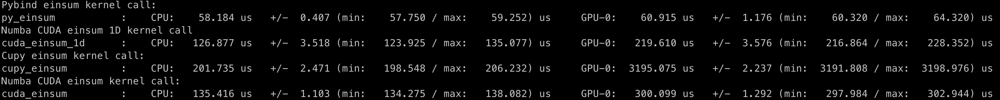

You can directly compile the kernel.cu file to test timing and correctness

``nvcc kernel.cu -o kernel``

``./kernel``

Or you can use CMakeLists.txt to build a pybind library and then run test.py to compare einsum kernels written in cuda/pybind, cupy, and numba cuda. The cuda/pybind code uses the cuda array interface to take pointers of arrays created in cupy.

``mkdir build; cd build;``

``cmake ..``

``make``

``cd ..``

``python test.py``

The python script will output timing using cupy's profiler. Example output on an Nvidia RTX A6000:

